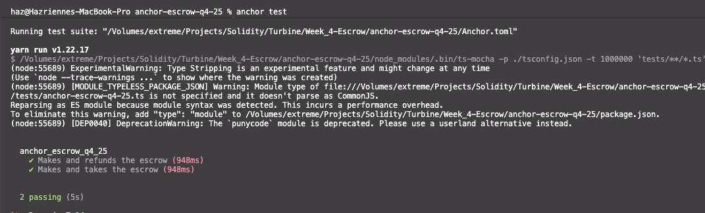

# Anchor Escrow Q4-25

Simple Solana escrow program built with Anchor, with three instructions:

- `make`
- `refund`
- `take`

Program ID (localnet):

- `Hg3LrWzULvyfQtGHcGCRStVm8B7R7aVT9kdYH4h3rHvz`

## Task Requirements

1. Write all instructions: `make`, `take`, `refund`.
2. Write tests for each instruction.

Status:

- All three instructions are implemented in Rust.
- Tests cover all three paths and pass.

## Project Structure

- Program:
  - `programs/anchor-escrow-q4-25/src/lib.rs`
  - `programs/anchor-escrow-q4-25/src/instructions/make.rs`
  - `programs/anchor-escrow-q4-25/src/instructions/refund.rs`
  - `programs/anchor-escrow-q4-25/src/instructions/take.rs`
  - `programs/anchor-escrow-q4-25/src/state/mod.rs`
- Tests:
  - `tests/anchor-escrow-q4-25.ts`

## Escrow State

`Escrow` account fields:

- `seed: u64`
- `maker: Pubkey`
- `mint_a: Pubkey`
- `mint_b: Pubkey`
- `receive: u64`
- `bump: u8`

PDA derivation:

- seeds: `["escrow", maker, seed_le_bytes]`

Vault:

- ATA for `mint_a`
- authority = escrow PDA

## Instruction Behavior

### `make(seed, deposit, receive)`

- Creates escrow PDA and vault ATA.
- Stores trade terms in escrow account.
- Transfers `deposit` amount of `mint_a` from maker ATA to vault.

### `refund()`

- Maker-only cancel path.
- Transfers all `mint_a` from vault back to maker ATA.
- Closes vault and escrow account.

### `take()`

- Taker accepts trade.
- Transfers `escrow.receive` amount of `mint_b` from taker ATA to maker ATA.
- Transfers full vault `mint_a` balance to taker ATA.
- Closes vault and escrow account.

## Prerequisites

- Rust + Cargo
- Solana CLI
- Anchor CLI
- Node.js + Yarn

## Install Dependencies

```bash
yarn install
```

## Build and Test

From this directory (`anchor-escrow-q4-25`):

```bash
anchor build
anchor test
```

Expected test output includes:

- `Makes the escrow`
- `Makes and refunds the escrow`
- `Makes and takes the escrow`

## Notes

- `anchor-lang` is configured with `init-if-needed`.
- `anchor-spl` uses `associated_token` + `token_2022` features.
- If you hit a Cargo/SBF `edition2024` issue on `blake3`, pin:

```bash
cargo update -p blake3 --precise 1.5.5
```


