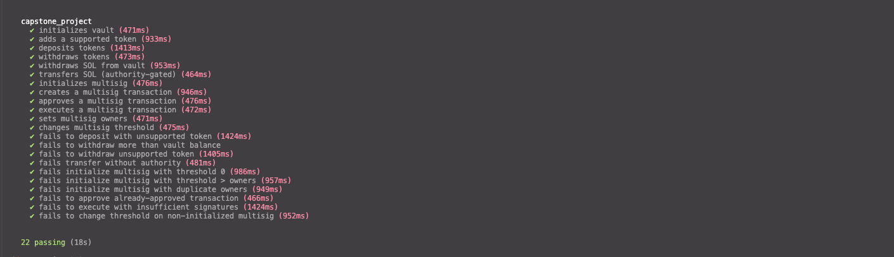

# Capstone Project — Multisig Vault

A Solana program built with [Anchor](https://www.anchor-lang.com/) that implements a **multisig wallet with vault management**. The vault supports SPL token deposits/withdrawals, SOL transfers, and a configurable multisig governance layer for executing on-chain transactions.

## Devnet Program ID

```
GJmkK7megeRLsTd1XuPGqXZh7ZFusAzKqdUqNx5Gqyb9
```

[View on Solana Explorer](https://explorer.solana.com/address/GJmkK7megeRLsTd1XuPGqXZh7ZFusAzKqdUqNx5Gqyb9?cluster=devnet)

## Features

- **Vault Initialization** — Create a PDA-based vault with authority and emergency admin
- **SPL Token Management** — Add supported tokens, deposit and withdraw with fee tracking
- **SOL Transfers** — Withdraw SOL and authority-gated SOL transfers
- **Multisig Governance** — Configurable M-of-N multisig for executing arbitrary on-chain transactions
  - Create, approve, and execute multisig transactions
  - Update owners and threshold dynamically
- **Fee System** — Configurable deposit/withdrawal fees with on-chain tracking
- **Event Logging** — Anchor events emitted for all operations

## Architecture

```
programs/capstone_project/src/
├── lib.rs                    # Program entrypoint (#[program] module)
├── state.rs                  # Vault account + sub-structs
├── error.rs                  # Custom error codes
├── events.rs                 # Event definitions
└── instructions/
    ├── initialize.rs         # Init vault PDA
    ├── deposit.rs            # SPL token deposit
    ├── withdraw.rs           # SPL token withdraw
    ├── withdraw_sol.rs       # SOL withdraw (lamport manipulation)
    ├── transfer.rs           # Authority-gated SOL transfer
    ├── initialize_multisig.rs
    ├── add_supported_token.rs
    ├── create_multisig_tx.rs
    ├── approve_multisig_tx.rs
    ├── execute_multisig_tx.rs
    ├── set_multisig_owners.rs
    └── change_multisig_threshold.rs
```

## Prerequisites

- [Rust](https://rustup.rs/) (1.75+)
- [Solana CLI](https://docs.solanalabs.com/cli/install) (1.18+)
- [Anchor CLI](https://www.anchor-lang.com/docs/installation) (0.30+)
- [Node.js](https://nodejs.org/) (18+) and Yarn

## Build

```bash
anchor build
```

## Test

```bash
anchor test
```

### Passing Tests (22/22)



## Deploy to Devnet

```bash
./deploy-devnet.sh
```

Or manually:

```bash
solana config set --url devnet
anchor build
anchor deploy --provider.cluster devnet
```
